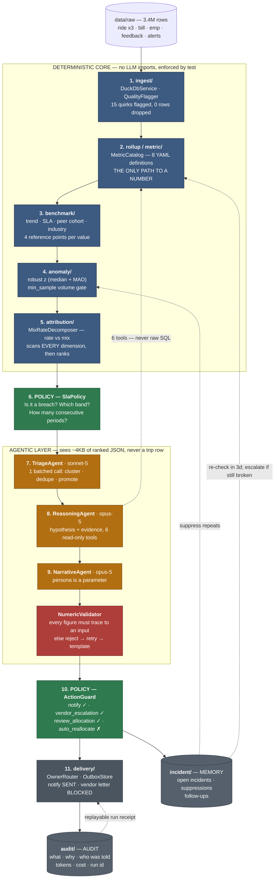

# MoveInSync — Agentic Intelligence & Reporting Layer for Enterprise Mobility

A transport manager does not need another dashboard. They need someone to notice that
on-time arrival fell from **95.31% to 92.46%** in June, work out that it was **not** a vendor
problem but a **morning-bus-on-manually-routed-trips** problem (LOGIN −5.17pts vs LOGOUT −0.77,
BUS −6.25 vs CAB −2.20, MANUAL routing −6.22 vs AUTO −2.20), check that against the SLA and
against last month, decide whether it is severe enough to escalate, write it up for the person
who owns it, and come back in three days to see whether it recovered. This repo is that
someone. It runs over 3.4M rows of real MoveInSync extracts (May–July 2026), and the division
of labour is deliberate and absolute: **deterministic Java computes every number; the model only
judges, explains, and writes.** A `NoLlmInCoreTest` fails the build if an Anthropic import ever
appears in `ingest`, `metric`, `benchmark`, `anomaly`, `attribution` or `policy`, and a
`NumericValidator` rejects any generated sentence containing a figure that was not in its input.
The result is a system that can be wrong about *judgement* — which a human can argue with — but
cannot be wrong about *arithmetic*.

---

## Architecture

**Blue = deterministic code · Green = policy · Amber = the model.** Policy runs **twice**: once
to decide what counts as a breach *before* a model sees anything, and once to decide what may be
*done* about it afterwards. Memory and audit close the loop back into detection.



Full package map and per-stage timings: **[docs/ARCHITECTURE.md](docs/ARCHITECTURE.md)**.

---

## Quickstart

Requires **JDK 21+** (JDK 26 works), **Maven 3.9+**, **Node 20+** — or **Docker** (see below).
No database and no cloud account: DuckDB runs in-process and the dataset is read straight from CSV.

```bash
cd "moveinsync assesment"

# 0. Dataset — the 7 CSVs must be in data/raw/ (gitignored; filenames contain spaces)
ls data/raw/
#   Ride_data _trip-may_2026.csv   Ride_data _trip-June_2026.csv
#   Ride_data _trip-July_2026.csv  alerts_data.csv  bill_data.csv
#   emp_Data.csv                   trip_feedback.csv

# 1. Backend on :8080
export ANTHROPIC_API_KEY=sk-...        # OPTIONAL — or GEMINI_API_KEY / SARVAM_API_KEY / NVIDIA_API_KEY
mvn spring-boot:run

# 2. Frontend on :4200 (separate terminal)
cd frontend && npm install && npm start

# 3. THE DEMO BUTTON — one POST runs the whole sense → reason → act pass
curl -X POST localhost:8080/api/runs \
     -H 'Content-Type: application/json' \
     -d '{"period":"2026-06-01","priorPeriod":"2026-05-01"}'
```

Then open **http://localhost:4200**. Or drive it entirely from the API:

```bash
curl localhost:8080/api/health                                  # ingest coverage + quality flags
curl localhost:8080/api/runs/latest                             # last run + its incidents
curl localhost:8080/api/incidents                                # open incidents
curl localhost:8080/api/incidents/INC-2026-06-001                # one incident, full payload
curl 'localhost:8080/api/attribution?metric=ota&period=2026-06'  # the waterfall, all dimensions
curl 'localhost:8080/api/reports/brief?persona=facilities_head&format=markdown'
curl localhost:8080/api/outbox
curl -X POST localhost:8080/api/incidents/INC-ID/recheck -H 'Content-Type: application/json' \
     -d '{"period":"2026-07"}'
curl -X POST localhost:8080/api/chat -H 'Content-Type: application/json' \
     -d '{"question":"why did on-time arrival drop in June?"}'
```

Verify the two claims the pitch rests on:

```bash
mvn test
#  MixRateDecomposerTest — contributions sum to the observed delta within 1e-9
#  SlaPolicyTest         — every breach rule, deterministic and reproducible
#  NoLlmInCoreTest       — no Anthropic import anywhere in the deterministic core
```

### Docker

The CSVs stay on the host (`data/raw/`, gitignored) and are mounted read-only into the API
container. Incident memory and the communications outbox are mounted read-write at
`data/state/` (`incidents.json`, `outbox.json`, `audit.jsonl`) so a `compose down` does not
erase the act loop. LLM keys are optional; copy `.env.example` to `.env` if you want a provider.

```bash
# data/raw/ must already contain the 7 extracts
docker compose up --build
```

Then open **http://localhost:4200**. Nginx in the `web` container proxies `/api/` to the API,
including `/api/outbox` and `/api/incidents/.../recheck`. Direct curls on **http://localhost:8080**
still work. Give the API a couple of minutes on first boot — ingest loads millions of rows before
`/api/health` reports `datasetReady: true`.

```bash
docker compose up --build -d          # detached
docker compose logs -f api           # ingest progress
docker compose down                   # keeps ./data/state on the host
```

### Running without a key

`ANTHROPIC_API_KEY` (or `GEMINI_API_KEY` / `SARVAM_API_KEY` / `NVIDIA_API_KEY`) is genuinely optional. Every agentic stage sits behind a port
(`TriagePort`, `ReasoningPort`, `NarrativePort`, `ChatPort`) with a deterministic implementation
in `pipeline/fallback/`. With no key the pipeline still ingests, computes, benchmarks, detects,
attributes, applies policy, opens incidents, schedules follow-ups and renders a templated brief —
you lose LLM clustering and the prose quality, and `tier` reads `deterministic` everywhere
instead of a model id. Set `app.llm.enabled: false` to force this path deliberately, e.g. for CI.

---

## Data quirks handled

The extracts are not clean, and the failure modes are not the ones a dictionary warns you about.
All 15 are handled in `ingest/DuckDbService` and counted by `ingest/QualityFlagger`. **No row is
ever dropped** — `rowsRead == rowsKept` is asserted, and every quirk becomes a counted flag that
propagates into `Quality.coverage` and `Quality.caveats` on the observations built from it.

| # | Quirk | Where | How it is handled |
|---|---|---|---|
| 1 | `trip_id` is comma-formatted (`"1,097,076"`) in ride/alerts/feedback, plain in bill, int in emp | all 5 sources | `TRY_CAST(replace(trip_id,',','') AS BIGINT)` everywhere — one canonical join key, no per-source branching |
| 2 | `bill_data.trip_id` contains the literal string **`'OverHead'`** — a plain `CAST` crashes the load | bill | `TRY_CAST` is mandatory platform-wide; overhead lines survive as `trip_id IS NULL` and are counted as `bill_overhead_rows`, not silently lost. Not documented in the supplied dictionary |
| 3 | `stwid = 0` / `"0"` is a placeholder, not an employee | emp, alerts, feedback | Excluded from per-rider denominators only; counted as `*_placeholder_stwid`. Trip-level metrics keep the rows |
| 4 | Four different date formats across five files | all | Parsed **per file**: ride `%B %d, %Y`; emp ISO; feedback + alerts + bill `%B %d, %Y, %I:%M %p`. `try_strptime` with a fallback chain, so a format drift lowers coverage instead of nulling a month |
| 5 | Epoch columns are comma-strings in ride, floats in emp | ride, emp | `TRY_CAST(replace(col,',','') AS BIGINT)` on ride; `TRY_CAST(... AS DOUBLE)::BIGINT` on emp |
| 6 | **Schema drift across the 3 monthly ride files**: `is_driver_nc`/`is_cab_nc` bool in Jun/Jul but string+nulls in May; `planned_km` float in May/Jun, string in July | ride | Read with `all_varchar=true, union_by_name=true, null_padding=true, sample_size=-1`, then `TRY_CAST` every column in the view. A month can never be silently dropped by an inferred type |
| 7 | `emp_data.planned_km` / `traveled_km` go **negative** (to −6.63) — physically impossible | emp | Retained and flagged `emp_negative_km`. Excluded from km aggregates, visible in coverage. Deleting them would hide a real upstream bug |
| 8 | `alerts_data.severity` contains a stray literal `"False"` alongside Sev-1/2/3, plus ~16k nulls | alerts | Kept as its own category. Investigation showed `severity='NA'` marks the 24-hour **auto-close** path (98.95% of NA rows), which is why the ack-latency distribution is bimodal — a machine, not slow humans |
| 9 | `trip_cost` and `delay_minutes` are comma-formatted strings | ride, bill | `replace(col,',','')` before every `TRY_CAST`; never used raw in arithmetic |
| 10 | Nulls are **meaningful**, not errors (unacknowledged alert, non-boarding employee, incomplete leg) | all | Never dropped. Materialised as explicit booleans — `unacknowledged`, `incomplete_leg`, `zero_km` — so a null becomes a queryable fact |
| 11 | `delay_minutes` outliers to 10,644 (>7 days) | ride | Flagged `delay_over_24h` at >1440. P90 metrics use robust statistics (median + MAD), so a 7-day outlier cannot move the headline |
| 12 | `bill_data.total_trip_km = 0` on ~42% of rows — **not missing data**, fixed-rate contracts | bill | A `billing_regime` column splits `FIXED_RATE` from `DISTANCE_BASED` at ingest. `cost_per_km.yaml` declares `segment_by: billing_regime` / `valid_segments: [DISTANCE_BASED]`, and the metric layer appends that predicate to **every** query — so no caller, agent or human, can obtain a cost-per-km on a fixed-rate contract |
| 13 | `bill_data.slab_name` null ~20% | bill | Coalesced to `NA` and kept as a grain member; counted as `bill_null_slab` |
| 14 | Tiny segments produce fake movement — `SPOT_2.0` = 702 trips, `trip_nodal='SHUTTLE'` = 244 trips showed a bogus **−26.6pt** swing | scanner | `min_sample` per metric (500 for OTA/cost, 5000 for driver NC, 300 for escort/p90) suppresses them before ranking. The gate is in YAML, not code |
| 15 | `trip_nodal` null for non-nodal home trips — expected | ride | `coalesce(trip_nodal,'NA')`; `NA` is a legitimate, reportable segment |

`GET /api/health` returns the live flag counts, coverage, and the caveat list for the current
load — the data-quality story is an API response, not a claim in a README.

---

## What it finds on the real data

Three findings, all reproduced by `POST /api/runs` on `{"period":"2026-06-01","priorPeriod":"2026-05-01"}`.
Every number below is from a query that was actually run; the analysis scripts are in
`tools/analysis/` and the long-form write-ups with artifact checks are in `docs/findings/`.

### 1. June broke — but only in one corner, and it wasn't the vendors

Campus OTA: **95.31% (May) → 92.46% (June) → 94.69% (July)**. A dashboard shows the dip. The
attribution engine shows that the dip is not diffuse:

| Dimension | Concentrated in | Delta (pts) | vs its counterpart |
|---|---|---|---|
| `trip_direction` | **LOGIN** | **−5.17** | LOGOUT −0.77 |
| `product_type` | **BUS** | **−6.25** | CAB −2.20 |
| `route_source` | **MANUAL** | **−6.22** | AUTO −2.20 |
| `business_unit` | vanta-Sea −4.15, pinnacle-Slc −3.12 | | catalyst-Sac −0.06 |
| `office` | Denver −4.15, Clearwater Campus −4.07 | | rest broadly flat |
| `vendor` | **nothing** — max share shift **0.79pts**, mix effect ≈ 0 | | |

The vendor decomposition is computed and returned anyway, ranked last, because *"we checked the
vendors and it wasn't them"* is a finding. **The story is morning buses on manually-planned
routes at two offices** — which is a routing-desk problem with a named owner, not a vendor SLA
letter. This is why attribution scans every declared dimension and ranks by explanatory power
rather than testing a hypothesis someone typed in.

### 2. An alarm stopped ringing — and it was a detector being switched off

`EMPLOYEE_SIGN_OFF_TIME_VIOLATION`: **7,670 (May) → 46 (Jun) → 20 (Jul) = −99.7%**. A dashboard
renders alerts that fired; it structurally cannot render alerts that *stopped*. The system finds
this because it scans series for absence as well as presence — and then, critically, refuses to
call it good news. Four artifact checks, all pointing at a config change on **2026-05-18**, not a
safety win:

- Clean cliff, not a decay: weekly 3,467 → 4,112 → **2** → 2 → 38.
- pinnacle's *other* alerts ran straight through the cutover: 750, 575, 865, 875, 714, 706…
- Trip volume **grew**: pinnacle-Slc 75,165 → 88,035 → 88,574.
- 7,627 of the 7,670 May alerts were `severity='NA'` **and auto-closed at 24h** — never triaged
  by a human. The 59 survivors in Jun+Jul are `Sev-3`, human-acknowledged, and fire at 20:00–23:00
  where May's peaked at 15:00. That is a *different, working* detector.

Excluding sign-off, pinnacle-Slc's alert rate is **35.73 → 39.43 → 37.88 — flat.** The honest
conclusion is *"7,664 alerts that were never real got turned off; nothing improved"*, and that is
what the incident says. An agent that reported "−99.7%, safety improved" would have been fluent,
confident, and wrong.

### 3. Cost-per-km is a broken metric for 42% of the spend

~42% of billing rows report `total_trip_km = 0`. That is not missing data — those are fixed-rate
contracts, where distance is not what is billed. Dividing their cost by their distance produces
numbers that are arithmetically valid and operationally meaningless:

| Contract | Rows | Zero-km share | Naive cost/km |
|---|---|---|---|
| 6S-HYD | 23,945 | 99.97% | **₹180,538** |
| 4S-HYD | 24,530 | 99.96% | ₹146,668 |
| 4S-EV-Z | 48,295 | 99.82% | ₹36,039 |
| 4Seater | 151,770 | 0.12% | ₹83 |
| DV_Package | 78,410 | 0.30% | ₹100 |

Restricted to `billing_regime = DISTANCE_BASED` the metric is stable and reportable: **77.29
(May) · 80.24 (June) · 78.49 (July)** at full coverage, over 368,849 distance rows against
252,093 fixed-rate rows. The guard is *declarative* — it lives in `cost_per_km.yaml`, so the
dashboard, the reasoning agent and the chat endpoint are all constrained by the same line of
config and cannot disagree. Related, from the same billing analysis: on `BUS-ORRNEW-TT` (one
office, no slabs, identical 12-seaters) vendors are paid **30–36% differently** — ₹9.15M over
three months, with nothing left to control for.

**Bonus finding the system surfaces but the SLA cannot:** `delay_minutes` scores LOGIN trips on
*arrival* (corr 0.81 with end-time deviation) but LOGOUT trips on *departure* (corr 0.07). A
4-passenger evening drop scores **99.66% on-time while finishing 38 minutes past its planned
end**. Across three months that is **410,879 employee-hours beyond planned end, 17.07 min per
seat** — invisible to today's OTA by construction. See `docs/findings/timeliness.md`.

---

## Cost at scale

The model never sees a trip row. It sees ~4KB of already-ranked JSON. That single decision is
what makes the economics work: **cost scales with the number of findings, not the number of
trips.** Ten times the data costs the same, because ten times the data still produces a handful
of things worth escalating.

Per nightly run (8 metrics × 9 grains ≈ 2,000 series → ~50 unusual → top 20 → **4 incidents**):

| Stage | Tier | Model | Calls | Prompt tok | Completion tok | USD |
|---|---|---|---|---|---|---|
| Triage — cluster, dedupe, promote | MID | `claude-sonnet-5` ($3 / $15 per Mtok) | 1 batched | 7,300 | 1,400 | $0.045 |
| Reason — hypothesis + evidence, tool use | STRONG | `claude-opus-5` ($5 / $25) | 8 (4 incidents × ~2 turns) | 46,400 | 7,200 | $0.315 |
| Narrate — 3 persona renderings | STRONG | `claude-opus-5` | 3 | 16,800 | 4,800 | $0.161 |
| Everything else (ingest → policy → guard → audit) | — | none | 0 | 0 | 0 | **$0.000** |
| **Total per run** | | | **12** | **70,500** | **13,400** | **≈ $0.52** |

Cache accounting is real, not aspirational: `CachedPrefixBuilder` pushes the metric catalog,
persona guides and SLA config into a byte-identical prefix, and `ModelTier` prices cache reads at
0.10× and writes at 1.25× the base input rate, so the reported figure reflects what caching
actually saved. `RunSummary` carries `promptTokens`, `completionTokens`, `estimatedCostUsd` and
per-stage timings on **every** run — the cost claim is a receipt, not an estimate.

**Monthly projection, per tenant:**

| Workload | Volume | Unit cost | USD / month |
|---|---|---|---|
| Nightly pipeline run | 30 runs | $0.52 | **$15.60** |
| Conversational Q&A (`claude-haiku-4-5`, $1 / $5) | 200 questions/day | $0.004 | **$24.00** |
| Weekly + monthly briefs | included in the run | — | $0.00 |
| **Per tenant** | | | **≈ $40 / month** |
| **50-tenant enterprise deployment** | | | **≈ $2,000 / month** |

For context: $40/month is under one hour of a transport manager's time, against a system that
reads 3.4M rows every night. **Latency:** the deterministic core completes in **~15s** end to end
(ingest ~8s dominates); a full agentic run is **~4 minutes**, of which ~3.5 minutes is the Opus
reasoning and narrative stages. `POST /api/runs` is synchronous on purpose — if it ever needed a
job queue, that would mean the funnel had stopped narrowing.

---

## How to extend

The core defines interfaces; infrastructure implements them. Arrows point inward only — the same
discipline that keeps the LLM out of the deterministic core.

| Change | What you touch | Code required |
|---|---|---|
| **New metric** | Drop a YAML file in `src/main/resources/metrics/` — formula, grains, `min_sample`, SLA key, caveats, and any `segment_by` guard | **None.** `MetricCatalog` loads it; scanner, benchmark, attribution, chat and the dashboard pick it up automatically |
| **New grain / SLA target / industry benchmark / cadence / tenant** | `application.yml` + the metric's `grains:` list | **None** |
| **New data source** (Kafka, S3, live API instead of CSV) | One `TripSource` implementation | **1 class** |
| **New fact store** (Redshift, Snowflake instead of DuckDB) | One `FactStore` implementation | **1 class** |
| **New model** (Bedrock, self-hosted, another vendor) | One `ModelClient` implementation; `ModelTier` already abstracts pricing | **1 class** |
| **New persona** | Add to `NarrativePort.PERSONAS` + a persona guide in the cached prefix | **Config** |
| **New channel** (Slack, email, ServiceNow instead of console) | One `NotificationSink` implementation | **1 class** |
| **New action type** | Add to `ActionGuard` with its permission rule and a `SlaPolicyTest` case | **1 enum + 1 test** |

Multi-tenancy is a `business_unit` predicate the metric layer already applies at every grain —
five business units are running side by side in the demo data today.

---

## Requirement coverage

| # | Requirement | Satisfied by | Evidence |
|---|---|---|---|
| **M1** | Working, demo-able prototype on the provided dataset | `SenseReasonActPipeline` + 7 REST endpoints + Angular console | `POST /api/runs` runs end to end on all 3.4M rows in ~4 min |
| **M2** | Agentic behaviour — senses, reasons, **acts**; not a passive dashboard | `AnomalyScanner` (sense) → `ReasoningAgent` + `AttributionService` (reason) → `ActionGuard` + `delivery/` outbox + `FollowUpScheduler` (act) | Opens an incident, **sends a notify to the routed owner**, refuses vendor escalation when vendor power is below the bar, schedules a re-check, and **re-measures a later period** unprompted |
| **M3** | Serves at least one named persona | 4 personas: `transport_manager`, `facilities_head`, `line_manager`, `executive` | `GET /api/reports/brief?persona=…` — persona is a parameter, not a fork in the code |
| **M4** | Contextualises metrics against ≥1 reference point | `BenchmarkService` attaches **all four**: `Trend`, `Sla`, `Peer`, `Industry` | Every `MetricObservation` carries a populated `References` record — never a bare number |
| **G1** | Combines ≥2 solution forms | **Five** of the five listed: conversational agent (`/api/chat`), proactive triggers (`CadenceScheduler`, `FollowUpScheduler`), automated narrative (`/api/reports/brief`), anomaly detection (`AnomalyScanner`), decision-support dashboard (Angular) | — |
| **G2** | Handles messy / missing data gracefully | `ingest/` + `QualityFlagger` — all 15 quirks above | `rowsRead == rowsKept`; nulls become flags; `GET /api/health` publishes coverage and caveats |
| **G3** | Proactive triggers, not purely on-demand | `CadenceScheduler` (nightly) + `FollowUpScheduler` (3-day re-check, 7-day escalation) + `Suppression` (don't re-raise what's already known) | `FollowUpSchedulerTest` |
| **B1** | Credible deployability — multi-tenancy, latency, cost | `business_unit` scoping at every grain; ~15s deterministic / ~4min full run; $0.52/run, ~$40/tenant/month with per-run token receipts | `RunSummary` on every response; `ModelTier` cache-aware pricing |
| **B2** | Output a facilities head could forward without rework | `NarrativeAgent` + `GET /api/reports/brief?persona=facilities_head&format=markdown` | Forwardable markdown, every figure validated against its source by `NumericValidator` — see [docs/SAMPLE_IO.md](docs/SAMPLE_IO.md) |
| **D1** | Source code repository | This repo | — |
| **D2** | Architecture diagram | Above, plus [docs/ARCHITECTURE.md](docs/ARCHITECTURE.md) | Mermaid, renders in GitHub |
| **D3** | README + setup instructions | This file — Quickstart runs from a clean clone | — |
| **D4** | Sample inputs / outputs | [docs/SAMPLE_IO.md](docs/SAMPLE_IO.md) | Real payloads with real numbers, including a **declined** chat question |
| **D5** | Presentation deck | [docs/DECK_OUTLINE.md](docs/DECK_OUTLINE.md) | 10 slides with the exact line to say on each |
| **D6** | Live demo | [docs/DEMO_SCRIPT.md](docs/DEMO_SCRIPT.md) | Timed 5-minute run sheet with an LLM-failure fallback |
| **E1** | *Business impact & experience (35)* | Three findings a human would have missed, one of which (the silent detector) is invisible to any dashboard by construction | `docs/findings/` — every claim with its artifact check |
| **E2** | *Agentic design & cost at scale (20)* | Model enters at stage 8 over ~4KB of JSON; tiered haiku/sonnet/opus; cache-aware pricing; cost flat in data volume | Cost table above; `RunSummary` receipts |
| **E3** | *Architecture & code quality (20)* | Ports-and-adapters; 8 metrics as data not code; policy separated from judgement; deterministic fallback for every agent | `NoLlmInCoreTest`, `MixRateDecomposerTest`, `SlaPolicyTest` |
| **E4** | *Functionality (25)* | One `curl` runs the whole thing; runs with **or without** an API key | `mvn spring-boot:run` then `POST /api/runs` |

---

## Repository layout

```
.
├── src/main/java/com/moveinsync/mi/
│   ├── ingest/       DuckDbService · QualityFlagger · IngestReport
│   ├── metric/       MetricCatalog · MetricQueryService — the only path to a number
│   ├── benchmark/    trend · SLA · peer · industry
│   ├── anomaly/      AnomalyScanner · RobustStats · CandidateRanker
│   ├── attribution/  MixRateDecomposer · AttributionService   ← the differentiator
│   ├── policy/       SlaPolicy · ActionGuard
│   ├── incident/     IncidentStore · FollowUpScheduler · Suppression   ← memory
│   ├── agent/        Triage · Reasoning · Narrative + guard/NumericValidator
│   ├── llm/          ClaudeClient · GeminiClient · SarvamClient · NimClient · ModelClientRouter
│   ├── pipeline/     SenseReasonActPipeline · CadenceScheduler · spi/ · fallback/
│   ├── delivery/     OwnerRouter · OutboxStore · ConsoleNotificationSink   ← act
│   ├── audit/        AuditLog — what, why, who was told, what it cost
│   └── controller/   runs · incidents · outbox · followups · chat · briefs
├── src/main/resources/metrics/   8 metric definitions — YAML, not code
├── frontend/         Angular 19 standalone — dashboard · incident · chat · brief · outbox
├── docs/             ARCHITECTURE · SAMPLE_IO · DECK_OUTLINE · DEMO_SCRIPT · findings/
├── tools/analysis/   the Python scripts that produced every number in docs/findings/
└── data/raw/         the 7 CSVs (gitignored)
```
