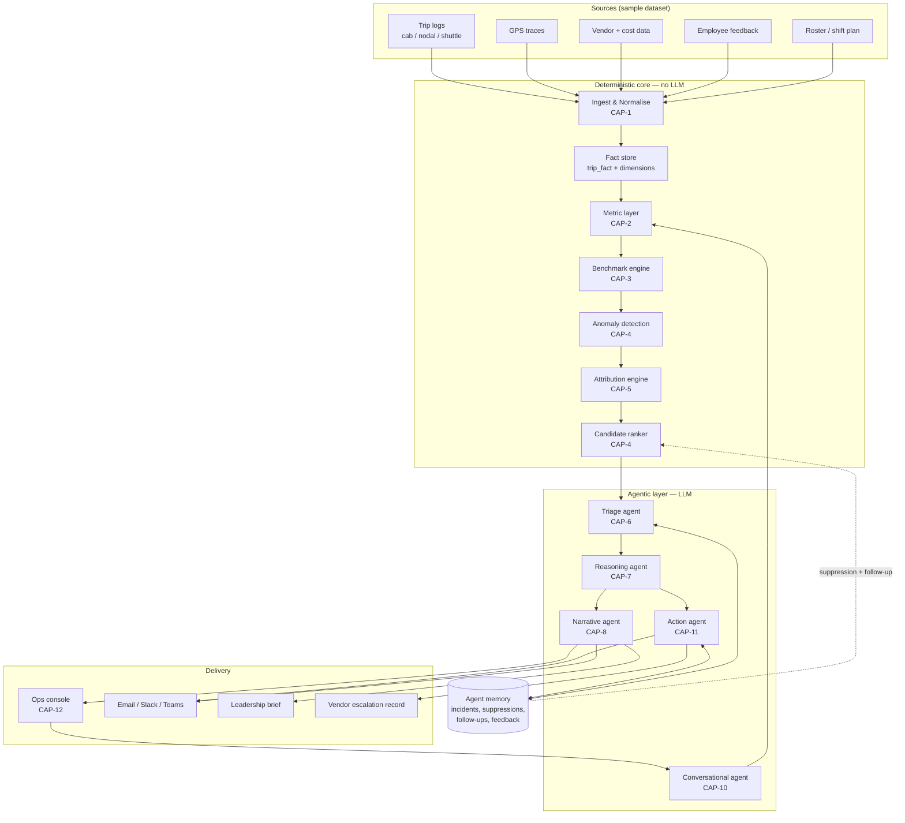
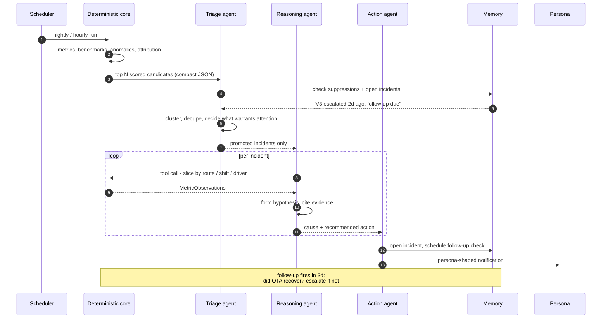
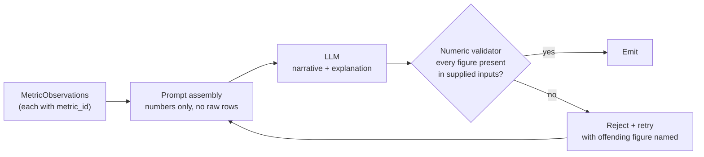

# Architecture Diagrams

Companion to [SPEC.md](SPEC.md). Diagrams only; the decisions they depict live in the kernel, `agents.md`, and `stack.md`.

## System overview

Read this as a funnel: millions of rows enter the deterministic core, a few dozen scored candidates leave it, and the LLM sees only those. That narrowing is the cost model (CAP-13) and the reason the constraint "LLM calls receive only ranked or aggregated payloads" is enforceable.

## Proactive cycle

The scheduled sense → reason → act loop (CAP-9). The follow-up check at the end is what makes this a loop rather than a one-shot, and is the concrete form of the brief's "acts with minimal human prompting".

## Numeric integrity guard

How the "LLM never computes a number" constraint is actually enforced rather than merely intended (CAP-7).

