# Architecture — where everything lives

One diagram, then the map. **Blue = deterministic code. Green = policy. Amber = the model.**
Policy appears twice: it decides what counts as a breach *before* the AI sees anything,
and what may be done about it *after*.

```mermaid
flowchart TB
    subgraph SRC["📁 data/raw — 3.4M rows, May–Jul 2026"]
        direction LR
        S1["Ride_data×3<br/>615,546 trips"]
        S2["bill_data<br/>620,942"]
        S3["emp_Data<br/>1,637,906"]
        S4["trip_feedback<br/>512,873"]
        S5["alerts_data<br/>51,699"]
    end

    subgraph CORE["⚙️ DETERMINISTIC CORE — zero LLM imports (enforced by NoLlmInCoreTest)"]
        direction TB
        ING["<b>ingest/</b><br/>DuckDbService · QualityFlagger<br/>15 edge cases · rowsKept == rowsRead"]:::det
        VIEW[("<b>DuckDB views</b><br/>trips · bills · emp<br/>feedback · alerts<br/>+ billing_regime")]:::store
        MET["<b>metric/</b><br/>MetricCatalog (8 YAML files)<br/>MetricQueryService<br/>← THE ONLY PATH TO A NUMBER"]:::det
        BEN["<b>benchmark/</b><br/>trend · SLA · peer · industry<br/>robust z-score (median+MAD)"]:::det
        ANO["<b>anomaly/</b><br/>AnomalyScanner · RobustStats<br/>CandidateRanker · min_sample gate"]:::det
        ATT["<b>attribution/</b><br/>MixRateDecomposer<br/>scans EVERY dimension, ranks<br/>⭐ the differentiator"]:::det
        ING --> VIEW --> MET --> BEN --> ANO --> ATT
    end

    POL1["🛡️ <b>policy/SlaPolicy</b><br/>Is it a breach? Which severity band?<br/>Deterministic · unit-tested · reproducible"]:::pol

    subgraph AI["🤖 AGENTIC LAYER — sees ~4KB of ranked JSON, never a row"]
        direction TB
        TRI["<b>TriageAgent</b> · sonnet-5<br/>1 batched call — cluster, dedupe, promote"]:::agt
        REA["<b>ReasoningAgent</b> · opus-5<br/>hypothesis + evidence via 6 tools"]:::agt
        NAR["<b>NarrativeAgent</b> · opus-5<br/>persona is a parameter"]:::agt
        VAL["<b>guard/NumericValidator</b><br/>every figure must exist in the input<br/>else reject + retry"]:::guard
        TRI --> REA --> NAR --> VAL
    end

    POL2["🛡️ <b>policy/ActionGuard</b><br/>What may we DO?<br/>escalate ✓ · reallocate ✗ (needs human)"]:::pol
    DEL["<b>delivery/</b> + <b>routing/</b><br/>transport manager · facilities head · line manager"]:::out

    MEM[("<b>incident/</b><br/>incidents · suppressions<br/>follow-ups")]:::mem
    AUD[("<b>audit/</b><br/>detected · why<br/>recommended · tokens")]:::mem

    subgraph UI["🖥️ frontend/ — Angular 19 standalone"]
        direction LR
        U1["Dashboard<br/>KPIs · Run now · incidents"]:::ui
        U2["Incident<br/>⭐ attribution waterfall"]:::ui
        U3["Chat"]:::ui
        U4["Brief"]:::ui
    end
    REST["<b>controller/</b> — 7 REST endpoints"]:::rest

    SRC --> ING
    ATT --> POL1 --> TRI
    NAR --> POL2 --> DEL
    REA -.->|"6 tools · never SQL"| MET
    POL2 --> MEM
    DEL --> AUD
    MEM -.->|"suppress · re-check in 3d"| ANO
    UI <--> REST
    REST --> MET
    REST --> MEM
    REST -.->|"POST /api/runs"| ING

    classDef det   fill:#3D5A80,stroke:#2F4763,color:#fff
    classDef store fill:#2F6E80,stroke:#245663,color:#fff
    classDef pol   fill:#2F7A4F,stroke:#25603E,color:#fff
    classDef agt   fill:#B26F12,stroke:#8C570E,color:#fff
    classDef guard fill:#AE3E39,stroke:#8A312D,color:#fff
    classDef out   fill:#4A5560,stroke:#39434D,color:#fff
    classDef mem   fill:#55606C,stroke:#454E58,color:#fff
    classDef ui    fill:#6B7785,stroke:#59636F,color:#fff
    classDef rest  fill:#4A5560,stroke:#39434D,color:#fff
```



---

## Where what lives

| Package | Owns | Key classes |
|---|---|---|
| `ingest/` | Reading messy CSV, never dropping a row | `DuckDbService` · `QualityFlagger` · `IngestReport` |
| `metric/` | The single definition of every number | `MetricCatalog` · `MetricQueryService` · `MetricDefinition` |
| `benchmark/` | The four reference points | `BenchmarkService` |
| `anomaly/` | What moved, and is it worth attention | `AnomalyScanner` · `RobustStats` · `CandidateRanker` |
| `attribution/` | **Who caused it** — across every dimension | `MixRateDecomposer` · `AttributionService` |
| `policy/` | Breach rules and action authorisation | `SlaPolicy` · `ActionGuard` · `PolicyDecision` |
| `incident/` | Memory — dedupe, suppression, follow-up | `IncidentStore` · `FollowUpScheduler` |
| `agent/` | Judgement, explanation, writing | `TriageAgent` · `ReasoningAgent` · `NarrativeAgent` |
| `agent/guard/` | Stops invented numbers | `NumericValidator` |
| `llm/` | Model tiering, caching, token accounting | `ClaudeClient` · `GeminiClient` · `SarvamClient` · `UsageRecorder` |
| `pipeline/` | Orchestration and cadence | `SenseReasonActPipeline` · `CadenceScheduler` |
| `delivery/` | Persona rendering, channels | `PersonaRenderer` · `NotificationSink` |
| `audit/` | Who was told what, and why | `AuditLog` |
| `controller/` | 7 REST endpoints | `RunController` · `IncidentController` · … |
| `frontend/` | Angular console | 4 standalone components |

---

## What happens on one run

```
POST /api/runs {"period":"2026-06-01","priorPeriod":"2026-05-01"}
        │
  ①  ingest        3.4M rows → DuckDB views, 15 quirks flagged      ~8s   code
  ②  metric        8 metrics × 9 dimensions                          ~2s   code
  ③  benchmark     4 references attached to every value              ~1s   code
  ④  anomaly       ~2,000 series → ~50 unusual (min_sample gate)     ~1s   code
  ⑤  attribution   decompose across ALL dimensions, rank by power   ~2s   code
  ⑥  rank          top 20 by severity×confidence×actionability       <1s   code
        ├─────────────────────────────────────────────────────────────────
  ⑦  POLICY        breach? severity band? consecutive periods?       <1s   code
        ├─────────────────────────────────────────────────────────────────
  ⑧  triage        20 → 4 incidents (1 batched call)                 ~6s   🤖 sonnet
  ⑨  reason        why, with evidence (4 calls, tool use)          ~3min   🤖 opus
  ⑩  narrate       3 persona renderings                              ~40s   🤖 opus
  ⑪  validate      every figure traced to an input, else retry       <1s   code
        ├─────────────────────────────────────────────────────────────────
  ⑫  ActionGuard   escalate ✓  ·  reallocate ✗ (human required)      <1s   code
  ⑬  deliver       route by ownership → persona → channel            <1s   code
  ⑭  remember      open incident, schedule 3-day re-check            <1s   code
  ⑮  audit         append run to audit.jsonl                         <1s   code
        │
   RunSummary { incidents, tokens by tier, cost USD, per-stage ms }
```

**Everything before ⑧ is free.** The model enters at step 8 and sees ~4KB of
already-computed JSON — never a trip row.

Three days later `FollowUpScheduler` fires, re-runs the metric, and if it hasn't
recovered raises an escalation **without being asked**. That loop is what makes this
agentic rather than a report generator.

---

## The three seams that make it extensible

| Change | What you touch | Code? |
|---|---|---|
| New metric | `resources/metrics/*.yaml` | none |
| New grain, SLA, persona, cadence, tenant | config YAML | none |
| Kafka instead of CSV | one `TripSource` impl | 1 class |
| Redshift instead of DuckDB | one `FactStore` impl | 1 class |
| Self-hosted model | one `ModelClient` impl | 1 class |
| Slack instead of console | one `NotificationSink` impl | 1 class |

The core defines the interfaces; infrastructure implements them. Arrows point inward
only — which is the same discipline that keeps the LLM out of the core.

---

## Why the AI can't lie about a number

```
MetricObservation (computed by SQL, carries metric_id)
        ↓
prompt assembly — numbers only, no rows
        ↓
      model
        ↓
NumericValidator — extract every figure, check it exists in the input
        ↓
   ✓ emit          ✗ reject, retry naming the offending figure,
                     then fall back to a deterministic template
```

`NoLlmInCoreTest` scans `ingest`, `metric`, `benchmark`, `anomaly`, `attribution`
and `policy` for any Anthropic import and fails if it finds one. The central claim
is a green test, not a slide.
