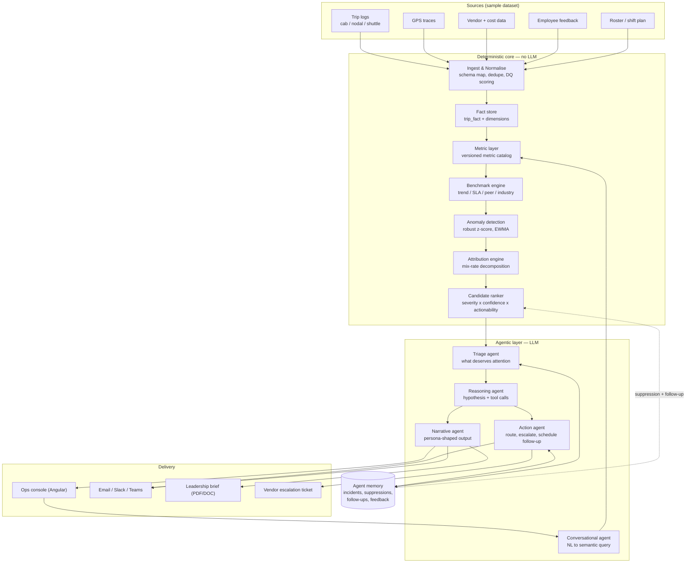
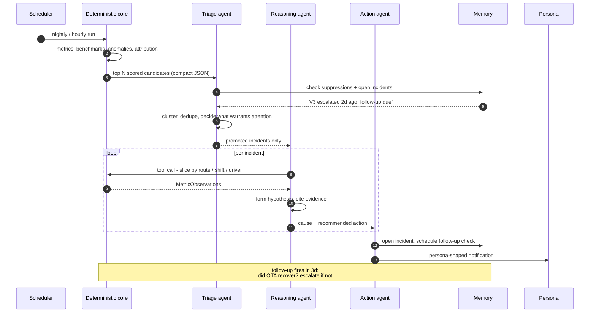

# Solution Architecture

> **Design thesis:** the LLM never computes a number. Deterministic code computes every metric;
> the LLM decides what matters, explains why, and composes the communication.

Companion to [problem-statement.md](problem-statement.md).

## 1. Problem decomposition

The brief reads as a reporting gap. It is five gaps:

| # | Gap | Symptom | Owner |
| --- | --- | --- | --- |
| 1 | Context | "OTA is 78%" — no trend, SLA, or peer reference | all personas |
| 2 | **Attribution** | Metric moved; *which vendor / route / shift* moved it is unknown | transport manager |
| 3 | Action | Cause known; escalation and comms still manual | transport manager |
| 4 | Latency | Weekly reports vs hourly operational reality | line manager |
| 5 | Audience | One dataset must become three persona-shaped artifacts | T&F head |

Gap 2 is the differentiator. The brief's own example — *"two vendors are responsible for the
gap"* — is an attribution statement, not a reporting statement.

## 2. System overview



**Read the diagram as a funnel.** Millions of rows enter the deterministic core; a few dozen
scored candidates leave it; the LLM sees only those. That funnel is the cost story.

## 3. Layer detail

### 3.1 Ingest & normalise

Maps the provided CSVs onto a canonical `trip_fact` grain: one row per trip leg. Every row
carries a **data-quality vector** rather than being dropped:

| Flag | Meaning | Downstream effect |
| --- | --- | --- |
| `gps_gap_pct` | share of expected pings missing | suppresses route-geometry metrics only |
| `roster_unmatched` | employee not in roster | excluded from experience metrics, kept in cost |
| `cost_imputed` | cost derived from vendor rate card | flagged in any narrative citing cost |
| `time_estimated` | arrival inferred from last valid ping | widens the delay confidence interval |

This directly serves the "handles messy data gracefully" good-to-have. Critically, **quality
flags propagate into the narrative** — the agent says "based on 84% GPS coverage" instead of
silently reporting a number built on holes.

### 3.2 Metric layer

A **versioned metric catalog** (YAML → SQL), not ad-hoc queries. Each metric declares its
grain, formula, SLA key, and direction.

```yaml
- id: ota
  label: On-Time Arrival
  formula: countIf(actual_arrival <= scheduled_arrival + grace) / count(*)
  grains: [global, vendor, route, shift, site, mode]
  direction: higher_is_better
  sla_key: sla.ota
  min_sample: 30
```

Families: **timeliness** (OTA, OTD, delay p50/p90), **cost** (per trip / per employee / per km,
vs budget), **safety** (speeding events, night-escort compliance, SOS), **utilisation**
(occupancy, empty-seat km), **sustainability** (CO2 per employee-km), **experience**
(CSAT/NPS, complaint rate), **vendor** (composite scorecard).

The catalog is the *only* way to get a number — dashboard, chat, and agents all call it.
One definition of OTA, everywhere.

### 3.3 Benchmark engine

Satisfies the mandatory "contextualises against at least one reference point" — we do all four.
Every computed value becomes a `MetricObservation`:

```json
{
  "metric_id": "ota", "grain": "vendor", "entity": "V3",
  "period": "2026-08", "value": 0.781, "sample_size": 4820,
  "references": {
    "trend":    { "prior": 0.853, "delta": -0.072, "robust_z": -3.1 },
    "sla":      { "target": 0.90, "delta": -0.119, "breached": true },
    "peer":     { "cohort_median": 0.884, "rank": "5 of 5", "percentile": 0 },
    "industry": { "benchmark": 0.87, "source": "config" }
  },
  "severity": 0.91,
  "quality": { "gps_coverage": 0.84, "confidence": "high" }
}
```

This object is the contract between the deterministic core and the agents. It is also exactly
what the brief asks for: a number that arrives already carrying its context.

### 3.4 Attribution engine — the differentiator

When a rate metric moves, decompose the delta with **mix-rate variance analysis**. For overall
rate `R`, entity share `w`, entity rate `r`:

```
rate effect(v) = w(v, t-1) x [ r(v,t) - r(v,t-1) ]        # vendor got worse
mix  effect(v) = [ w(v,t) - w(v,t-1) ] x [ r(v,t-1) - R(t-1) ]   # volume shifted to a weak vendor

sum over v of [ rate effect + mix effect ]  ~=  R(t) - R(t-1)
```

That yields statements the brief explicitly wants:

> OTA fell 7.2pts. Vendor V3's rate decline accounts for **4.2pts**; a further **1.8pts** is mix
> shift as V3 absorbed volume from V1. Remaining 1.2pts is spread across 9 routes.

Cheap, deterministic, auditable, and it sums to the total — no LLM involved. Run the same
decomposition across vendor / route / shift / site and rank by absolute contribution.

### 3.5 Anomaly detection & ranking

Robust z-score (median + MAD, resistant to the outliers this data is full of) and EWMA on each
series, with day-of-week and holiday awareness. Then a deterministic ranker:

```
score = severity x confidence x actionability x recency x (1 - suppression)
```

`actionability` is the underrated term — a metric that moved but has no owner or lever scores
low and never reaches a human. This is what stops the system becoming an alert firehose.

**Only the top N candidates cross into the LLM layer.** Everything above this line is code.

### 3.6 Agentic layer



| Agent | Job | Model tier | Why an LLM is needed |
| --- | --- | --- | --- |
| **Triage** | Cluster, dedupe, suppress, decide what a human should see | fast/cheap | Judgement about salience; one batched call for the whole day |
| **Reasoning** | Hypothesis + evidence via tool calls into the metric layer | strong | Causal reasoning over heterogeneous evidence |
| **Action** | Choose channel, persona, escalation level; schedule follow-up | fast/cheap | Routing decision, constrained tool set |
| **Narrative** | Leadership-ready prose, persona-shaped | strong | Genuinely a writing task |
| **Conversational** | NL → semantic-layer call (not raw SQL) | fast/cheap | Intent parsing over a bounded function surface |

**The follow-up check is what makes this a loop rather than a one-shot.** The action agent
schedules "re-check OTA for V3 in 3 days"; if unrecovered, the system escalates itself without
being asked. That is the "acts with minimal human prompting" requirement, literally.

Guardrails: agents receive numbers, never raw rows; every figure in output must carry a
`metric_id`; a post-generation validator rejects any narrative containing a number absent from
the supplied observations.

### 3.7 Persona shaping

Same incident, three renderings — this is one prompt parameter, not three pipelines.

| Persona | Trigger | Form | Content |
| --- | --- | --- | --- |
| Transport manager | real-time, on breach | Slack/Teams push | Cause + attribution + one recommended action + escalate button |
| T&F head | weekly / monthly | Forwardable brief | Cost/safety/experience narrative, SLA posture, vendor ranking, trend charts |
| Line manager | per shift | Digest before shift start | Who's late, ETA impact, floor-readiness delta |

The T&F head output targets the bonus criterion explicitly: **forwardable to leadership without
rework**.

## 4. Cost & scale

Criterion 2 is 20 points and most submissions ignore it. Concrete numbers for a
5,000-trips/day tenant:

| Stage | Volume | LLM? | Cost driver |
| --- | --- | --- | --- |
| Ingest + metrics | ~5k rows/day | no | compute, seconds |
| Benchmark + anomaly | ~2k series | no | compute |
| Attribution | top ~50 series | no | compute |
| **Triage** | 1 batched call/day | yes | ~4k in / ~800 out |
| **Reasoning** | ~3-6 promoted incidents | yes | ~3k in / ~1k out each |
| **Narrative** | 1 weekly + 1 monthly | yes | ~8k in / ~2k out |
| **Chat** | on demand | yes | ~2k in / ~600 out per turn |

That is single-digit dollars per tenant per month at current pricing — a claim that holds up
because the deterministic core absorbs the volume.

Cost levers, all real:
- **Tiered models** — cheap model for triage/routing/chat intent, strong model only for causal
  reasoning and narrative.
- **Prompt caching** on the static prefix (metric catalog, persona style guides, SLA config) —
  it is identical across every call for a tenant.
- **Batching** — one triage call for the day's full candidate set, not one per anomaly.
- **Deterministic pre-filter** — kills >95% of candidates before any token is spent.
- **Precomputed aggregates** — chat and dashboard hit materialised rollups; p95 well under a
  second without touching a model.

## 5. Tech stack and why

| Layer | Choice | Why |
| --- | --- | --- |
| Backend | **Java 21 + Spring Boot 3** | Brief prefers it and MoveInSync is a Java shop — scores criterion 3 ("deployable into an existing platform") outright. Mature scheduling, DI, testing. |
| Analytics | **DuckDB** (embedded, over Parquet) | In-process OLAP, zero infra, fast enough to be honest at hackathon scale. Deployability story is clean: same SQL moves to Athena/Redshift/Snowflake — only the JDBC URL changes. |
| State | **Postgres** | Incidents, suppressions, follow-ups, feedback. Relational, transactional, boring — correct. |
| LLM | **Claude (Anthropic API)**, tiered | Strong tool-use for the semantic-layer functions; prompt caching maps directly onto our static-prefix cost lever. Bedrock as the alternate route if enterprise procurement prefers it. |
| Frontend | **Angular 17+** | Brief prefers it; console + chat + charts. |
| Scheduling | **Spring `@Scheduled`** → EventBridge in prod | Drives the proactive triggers, which are a good-to-have. |
| Deploy | **AWS**: ECS Fargate, S3 (Parquet), RDS, EventBridge | Brief prefers AWS; standard, defensible. |

**Honest alternative:** Python + FastAPI + Polars would be roughly 2x faster to build. If the
deadline is tight, take it — but you trade away part of criterion 3. Java is the better
*scored* choice; Python is the better *velocity* choice. Decide against the calendar.

## 6. Multi-tenancy & deployability (bonus)

- `tenant_id` on every fact row; the semantic layer injects the filter — no query can omit it.
- Per-tenant SLA config, persona routing, and quiet hours.
- Per-tenant token budget with graceful degradation: exhaust the budget and the system falls
  back to deterministic alerts, which still work. It never goes dark.
- Metric catalog is versioned, so a definition change is a migration, not a silent shift.
- The agent layer talks to the metric layer over an interface, so dropping this onto a real
  mobility platform means implementing one adapter — not rewriting the agents.

## 7. Scope ladder

Build in this order; each level is independently demo-able.

| Level | Scope | Status |
| --- | --- | --- |
| **L0** | Ingest + metric catalog + benchmarks. Numbers with context. | must |
| **L1** | Anomaly detection + attribution. *Which vendor caused it.* | must — the differentiator |
| **L2** | Triage + reasoning + narrative. Proactive daily digest. | must — this is the "agentic" mandate |
| **L3** | Conversational agent over the semantic layer. | should |
| **L4** | Action agent: escalation, follow-up loop, self-escalation. | should — closes the loop |
| **L5** | Angular console + leadership brief export. | polish |

L0-L2 alone satisfies every mandatory requirement. Everything above is score.
